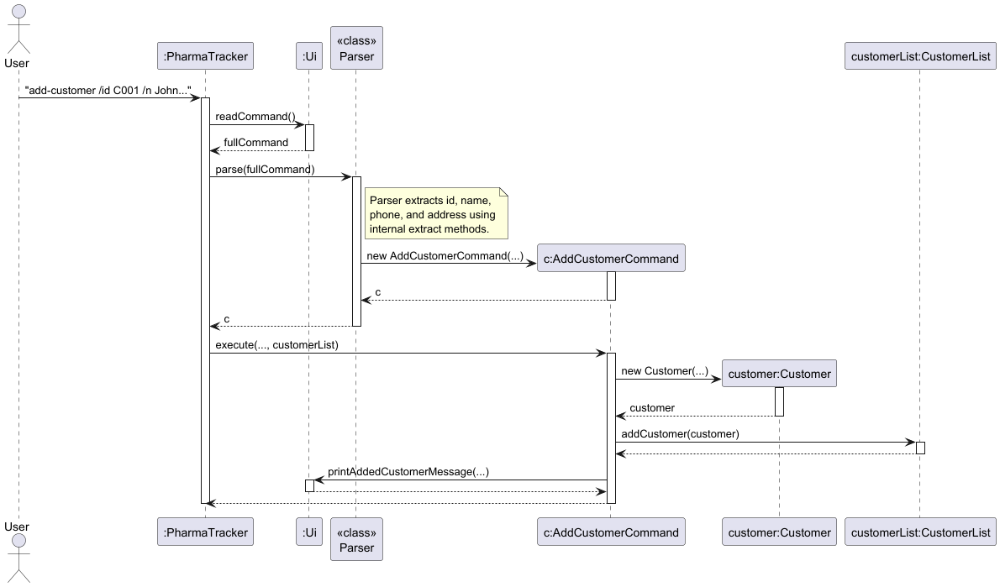

# Project Portfolio Page: Shamit (ShamitGupta)

## Project Overview: PharmaTracker
PharmaTracker is a Java-based CLI application engineered for pharmacy professionals to manage medication inventory and patient records with high precision. Designed for environments where speed and keyboard-driven workflows are prioritized over GUI navigation, the system allows staff to handle complex tasks—such as tracking stock levels, monitoring expiry dates, and managing customer histories—through rapid command-line inputs.

---

## Technical Contributions Summary

### **Code Contributions**
My full technical contribution history, including logic implementation and bug fixes, can be viewed on the [PharmaTracker Dashboard](https://github.com/ShamitGupta/tp).

### **Functional Enhancements**
* **Customer Infrastructure (Backend)**: Engineered the foundational data layer for the patient tracking system, enabling the application to move beyond simple inventory to a relational patient-management tool.
* **System Integration Glue (Architectural Design)**: Designed the logical "glue" that links the medication and patient systems, ensuring data integrity during atomic dispense-and-record operations.
* **Data Persistence Layer**: Developed the file-based storage logic within the `Storage` class to ensure patient data and dispensing records survive application restarts.
* **Intelligent Stock Monitoring**: Created the `lowstock` logic and configurable threshold engine, allowing users to identify dwindling supplies before they impact patient care.
* **Advanced Command Processing**: Refined the command parser to support complex, multi-parameter inputs required for customer registration and partial record updates.

---

## Detailed Enhancement: Backend Customer Infrastructure

### **Rationale and Objective**
The primary goal of this enhancement was to provide a robust backbone for v2.0 patient-centric features. I designed the `Customer` and `CustomerList` modules to bridge the gap between simple medication tracking and comprehensive pharmacy management. By establishing this backend early, I provided a stable API for my teammates to build specialized features like history tracking and record updates.

### **Technical Implementation**
The system is built upon two core classes that follow clean architectural principles:

1.  **The `Customer` Model**: This represents a single patient and encapsulates data including their `customerId`, `name`, `phone`, and residential `address`. A critical design feature is the internal `ArrayList<String>` designated as `dispensingHistory`, which dynamically grows as medications are dispensed to that individual, creating a permanent clinical audit trail.
2.  **The `CustomerList` Wrapper**: This acts as the primary in-memory data manager. It provides clean APIs for common operations such as `addCustomer()`, `deleteCustomer()`, and keyword-based retrieval via `findByName()`, ensuring that the rest of the application interacts with data in a controlled, validated manner.

### **Design Decisions and Logic Flow**
* **Single Responsibility Principle**: I chose to separate the data model (`Customer`) from the collection logic (`CustomerList`). This decoupling ensured that team members could implement user-facing commands without needing to manage the internal storage list directly.
* **Validation Layer**: By wrapping the internal list, I implemented strict index validation (using `assert` statements) to prevent common runtime errors like `IndexOutOfBoundsException` during rapid command entry.

The following sequence diagram demonstrates the interaction between components during a customer registration:

### **Evaluative Comparison of Alternatives**
* **Alternative: Integrating Customers into Inventory**: I considered adding customer tracking directly to the existing `Inventory` class. This was rejected to avoid a "God Class" anti-pattern; keeping them separate makes the code more modular and easier to debug.
* **Alternative: Stateless Text File Storage**: Another option was to write records directly to disk without an in-memory model. This was rejected because performance would degrade as the patient database grew, making search operations like `findByName()` inefficient.

---

## Documentation and User Support Contributions

### **User Guide Portfolio**
I took a leadership role in ensuring the User Guide was not just a technical manual, but a practical resource for pharmacy staff:

* **Command Design Documentation**: I authored the technical instructions for all patient-related commands, including `add-customer`, `listcustomers`, `view-customer`, and `updatecustomer`.
* **Logic Clarification**: For the `lowstock` command, I explicitly documented the strict `<` (less-than) comparison logic to prevent confusion during inventory audits.
* **Discrepancy Audit**: I performed a comprehensive cross-referencing audit between the manual and the source code, correcting a critical error where the application-closing command was listed as `bye` in the guide but implemented as `exit` in the code.
* **Quick Reference Tools**: I developed the **Command Summary** table, providing users with a high-density reference guide for all 17 available commands.

### **Developer Guide Portfolio**
To support the long-term maintainability and architectural clarity of the project, I authored documentation for the following high-level areas:

* **Architectural Wiring (Integration Glue)**: I planned and documented the "Integration Glue" section, describing the planned enhancement to synchronize the inventory and patient systems. I explained how parameter injection in the command execution loop supports atomic dispensed-medication records.
* **Data Layer Infrastructure**: I detailed the implementation of the core `Customer` and `CustomerList` backend, explaining how the decoupled data layer serves as the internal API for v2.0 features.
* **Technical Rationale Analysis**: My contributions include design consideration tables that analyze technical trade-offs, such as the use of dynamic `ArrayList` storage for patient audit trails and the rationale for wrapping collection lists in manager classes.